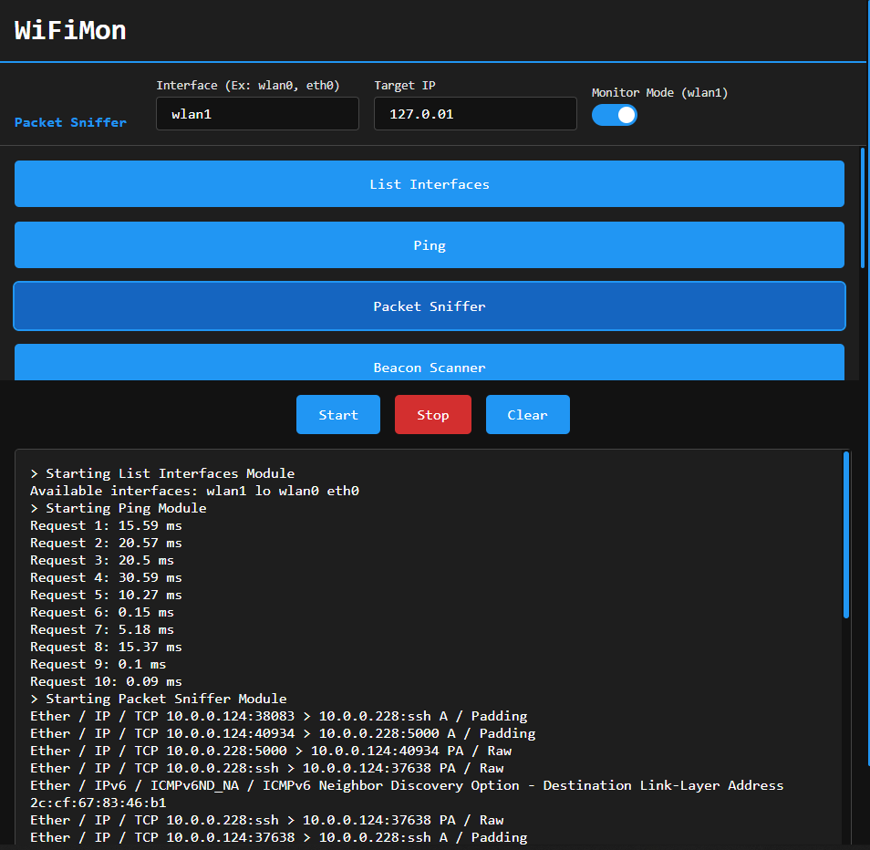

# Getting started:
* **Install UV:**
https://docs.astral.sh/uv/getting-started/installation/  
* `source .venv/bin/activate` This activates the python virtual environment (venv). To leave the venv type `deactivate`
* `uv sync` to get latest packages from the lockfile.

